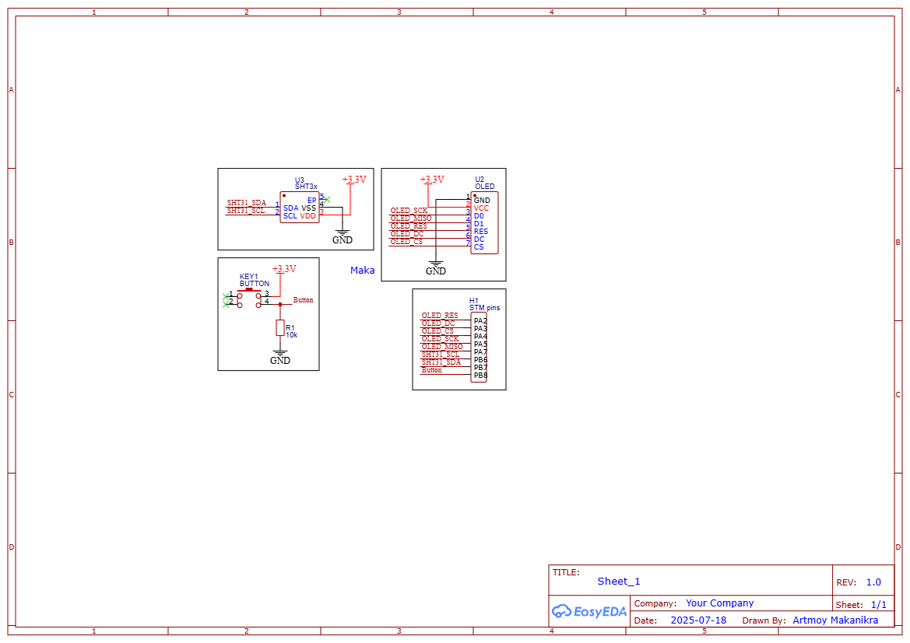

# 🌡️ STM32 Temperature and Humidity Display

Простой embedded-проект на базе STM32, считывающий температуру и влажность с датчика **SHT3x** и выводящий значения на **OLED-дисплей SSD1306 (SPI)**. Управление выводом на дисплей реализовано с помощью кнопки.

---

## 📌 Описание

Проект демонстрирует базовую работу с шиной **I2C** (датчик) и **SPI** (дисплей), а также обработку кнопки без дребезга. При включении отображаются текущие значения температуры и влажности. Кнопка меняет вывод температуры на сообщение о выключенном режиме.

---

## 🧠 Основная логика

- Данные с датчика SHT31 считываются каждые 2 секунды
- OLED отображает температуру и влажность
- Кнопка переключает отображаемый текст
- При отключении — дисплей полностью выключается (сброс VCC или логики)

---

## ⚙️ Подключения

| Назначение          | Пин STM32     | Интерфейс     | Комментарий              |
|---------------------|---------------|---------------|--------------------------|
| **SHT31 SDA**        | PB7           | I2C           | Линия данных             |
| **SHT31 SCL**        | PB6           | I2C           | Тактирование             |
| **OLED MOSI (DIN)**  | PA7           | SPI           | Данные на дисплей        |
| **OLED SCK**         | PA5           | SPI           | Тактирование дисплея     |
| **OLED CS**          | PA4           | SPI (CS)      | Выбор дисплея            |
| **OLED DC**          | PA3           | GPIO          | Data/Command             |
| **OLED RESET**       | PA2           | GPIO          | Аппаратный сброс         |
| **Кнопка**           | PB8           | GPIO Input    | Подключена к земле       |

> 🔧 *Пины можно перенастроить в .ioc файле STM32CubeMX*

---

## 🛠 Требования

- STM32F103C8T6 (или совместимая Blue Pill)
- Датчик температуры и влажности **SHT31** (I2C)
- OLED-дисплей **SSD1306** (SPI)
- Кнопка
- Резисторы, соединительные провода
- Источник питания 3.3В

---

## 📂 Структура проекта

project/
├── Core/
│ ├── Src/ # Основной код
│ └── Inc/ # Заголовочные файлы
├── Drivers/
│ └── SSD1306/ # Драйвер дисплея
├── sht31.c/.h # Драйвер датчика
├── .ioc # Файл STM32CubeMX
├── wiring_diagram.png # Схема подключения
├── README.md
└── LICENSE

---

## ▶️ Как использовать

1. Открой проект в **STM32CubeIDE**
2. Настрой шины I2C и SPI согласно `.ioc` файлу
3. Подключи компоненты по схеме `wiring_diagram.png`
4. Скомпилируй и загрузи прошивку на STM32
5. Нажми кнопку и температура и влажность появятся на дисплее, кнопка управляет отображением 

---

## 📷 Схема подключения

---

## 🧾 Лицензия

Проект распространяется под лицензией **MIT**. См. файл [`LICENSE`](LICENSE).

---

## ✍️ Автор

**Автор:** [ArtyomMaka]  
**Год:** 2025  
[Telegram](https://t.me/amv_5000) • [VK](https://vk.com/amv_5000)
